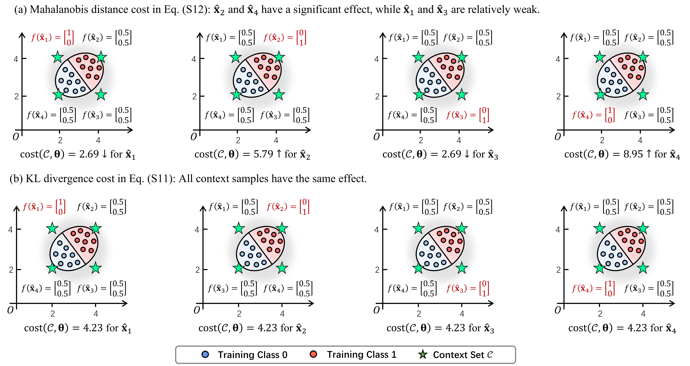
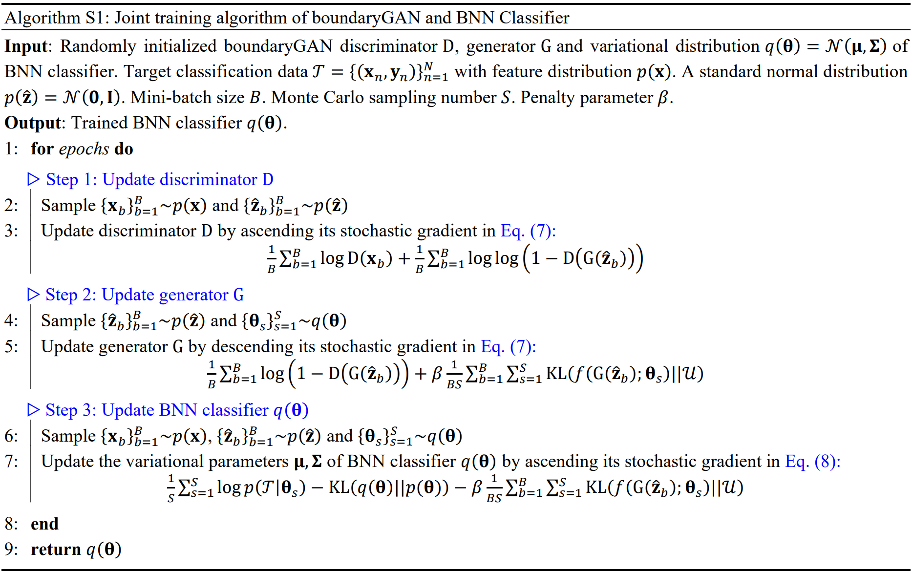
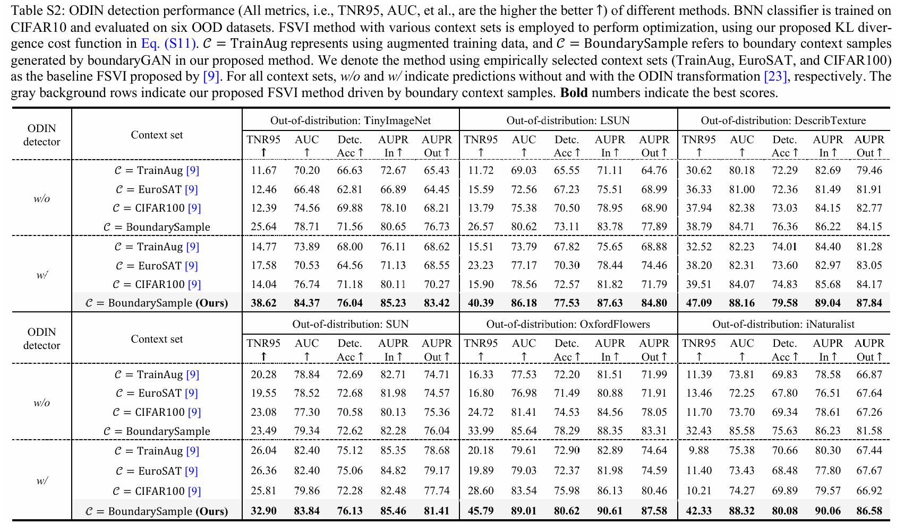
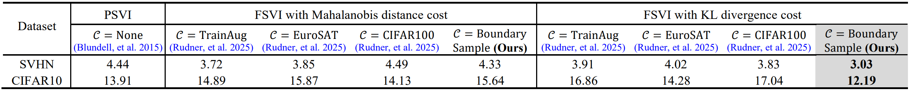
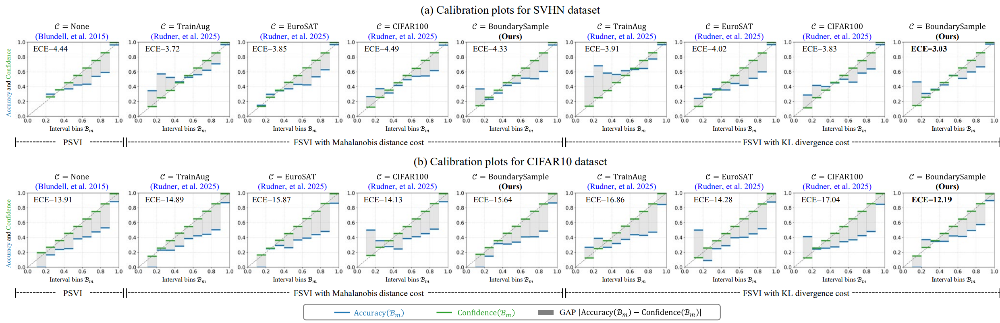
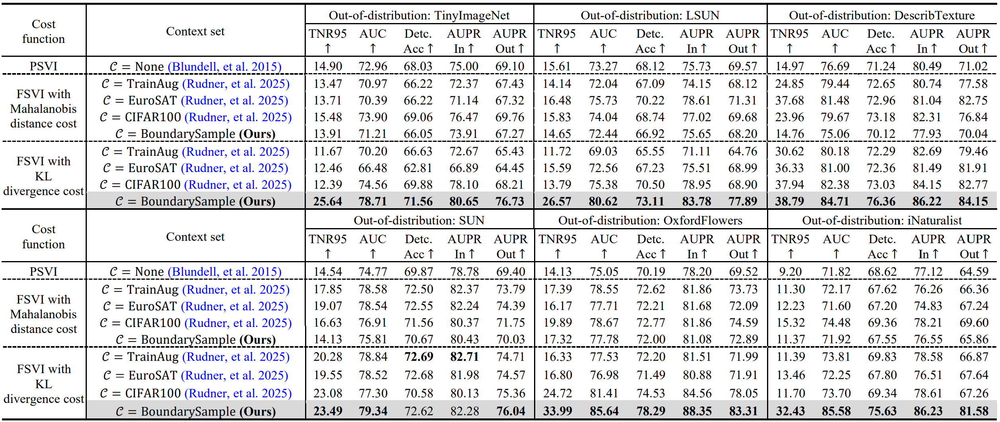
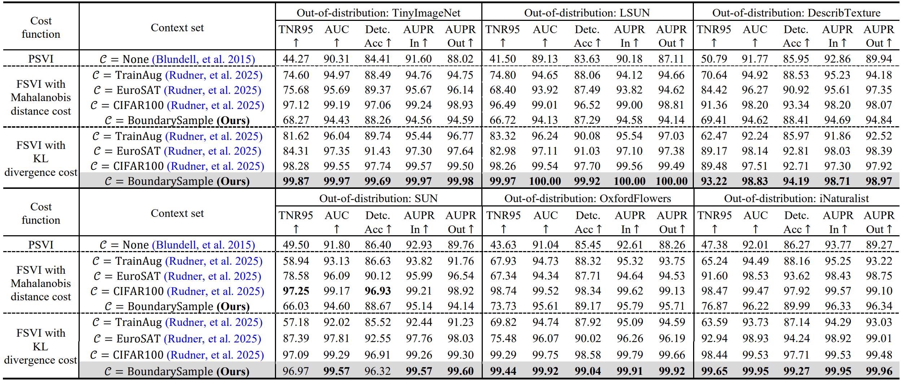
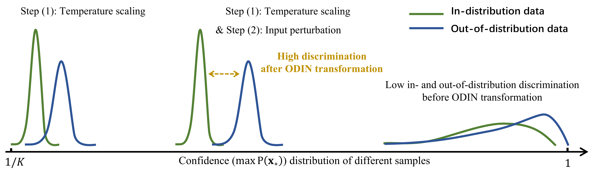
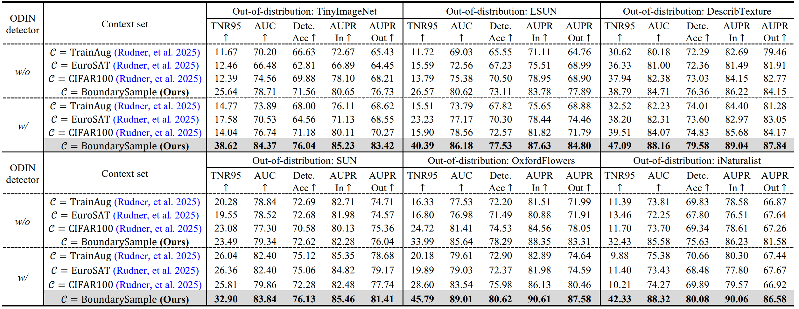

# Function-Space Variational Inference Augmented by BoundaryGAN in Bayesian Neural Networks

This repository is an implementation of our paper **"Function-Space Variational Inference Augmented by BoundaryGAN in Bayesian Neural Networks"** in PyTorch. In this work, we propose a new function-space regularization training framework to address the context set specification problem in existing Function-space variational inference (FSVI) methods.

Existing methods mainly rely on domain knowledge to specify the context set manually. However, we find that this empirical specification could lead to unstable results and sometimes even harmful ones. Meanwhile, we observe that using only "**_boundary samples_**" around training distribution as the context set is sufficient and effective. Thus, in this work:

- (1) We propose a novel functional-space variational inference (FSVI) framework, which incorporates a context-al sample generative model into the variational learning process, utilizing the generated boundary context samples to improve the predictive performance of Bayesian neural networks (BNNs).
- (2) We propose a novel and simpler doubly evidence lower bound (dELBO) optimization objective defined across training and context data, thereby enabling more efficient variational inference to enhance the model’s OOD detection capability.
- (3) We propose a novel joint training algorithm to iteratively train the contextual generative model and optimize the dELBO objective. This enables these two components to mutually enhance each other’s performance throughout the training process.
- (4) Through extensive experiments conducted on both 2D and real-world image classification datasets, the practical effectiveness of the proposed theoretical framework is verified. This includes not only improvements in pre-diction accuracy, but also more significant enhancements in uncertainty calibration and out-of-distribution (OOD) detection capabilities.

The overview of the proposed method is shown as following (see Section 3.1 in our paper for more details):


Our novel FSVI training framework consists of two main stages:

- **Stage (a)**: Based on a generative model boundaryGAN, boundary context samples are generated around the labeled in-distribution region.
- **Stage (b)**: By incorporating the generated context data, FSVI is used to infer the variational distribution q(θ).

## Table of contents

- [Requirements](#requirements)
- [Datasets](#datasets)
- [Checkpoints](#checkpoints)
- [Toy examples](#toy-examples)
- [Perform FSVI with boundaryGAN (Ours)](#perform-fsvi-with-boundarygan-ours)
- [Perform FSVI with empirical specified context set (Baselines)](#perform-fsvi-with-empirical-specified-context-set-baselines)
- [Evaluations](#evaluations)
    - [(a) Classification accuracy performance](#a-classification-accuracy-performance)
    - [(b) Uncertainty calibration performance](#b-uncertainty-calibration-performance)
    - [(c) OOD detection performance](#c-ood-detection-performance)
    - [(d) ODIN detection performance](#d-odin-detection-performance)
- [Perform boundaryGAN-FSVI on customized datasets](#perform-boundarygan-fsvi-on-customized-datasets)
- [Thanks](#thanks)
- [Cite us](#cite-us)

## Requirements
You can refer to the `requirements.txt` file to download all the necessary dependencies.

The main library versions are as follows:

- torch == 1.10.0+cu113
- torchvision == 0.11.1+cu113
- numpy == 1.21.4
- scikit-learn == 1.3.2


## Datasets
Our work focuses on the functional-space variational inference (FSVI) methods. The effectiveness of the proposed novel framework has been empirically verified on both 2D datasets and multiple image classification datasets. Specifically, the datasets are divided into three categories: (1) Training set; (2) Context set; and (3) Out-of-distribution (OOD) datasets.

**2D datasets**: We illustrate the impact of different context set specifications on FSVI performance through an experiment using a synthetic 2D dataset. The dataset generation method is available in the `get_two_gaussian()` function of the [data_loader.py](data_loader.py) file, with detailed descriptions provided in Section 1 of the paper.
- The training dataset is generated by a mixture of two Gaussian distributions.
- The context sets are manually specified as points with different positional relationships to the training data.
- The OOD datasets cover all input feature space except training data region.

**Image datasets**: All image benchmarks used in this work have been saved <u>[here](https://drive.google.com/file/d/115Zzs6EuN-Z3HCc5T89ptkkQZb6oyPJO/view?usp=sharing)</u>. Please download them and unzip them to the `/data` folder in the main directory. Note that each dataset subfile contained in this folder also needs to be unzipped. The final corresponding folder directory should be as follows:

```
data/
├── cifar10-data
├── svhn-data
├── cifar100-data
├── eurosat-data
├── ...
├── cifar10-data.zip
├── svhn-data.zip
├── cifar100-data.zip
├── eurosat-data.zip
├── ...
```

The preprocessing for all datasets can be found in functions `getTargetDataSet()`, `getContextDataSet()`, and `getNonTargetDataSet()` of [data_loader.py](data_loader.py).

- The training datasets include (i) [SVHN](http://research.google.com/pubs/archive/37648.pdf) and (ii) [CIFAR10](http://www.cs.utoronto.ca/~kriz/learning-features-2009-TR.pdf).
- The context sets consist of (i) Training data augmentation, (ii) [EuroSAT](https://ieeexplore.ieee.org/abstract/document/8736785), and (iii) [CIFAR100](https://www.cs.toronto.edu/~kriz/learning-features-2009-TR.pdf).
- The OOD dataset contains (i) [TinyImageNet](https://ieeexplore.ieee.org/abstract/document/5206848/), (ii) [LSUN](https://arxiv.org/abs/1506.03365), (iii) [DescribTexture](http://openaccess.thecvf.com/content_cvpr_2014/html/Cimpoi_Describing_Textures_in_2014_CVPR_paper.html), (iv) [SUN](https://ieeexplore.ieee.org/abstract/document/5539970/), (v) [OxfordFlowers](https://ieeexplore.ieee.org/abstract/document/4756141/) and (vi) [iNaturalist](http://openaccess.thecvf.com/content_cvpr_2018/html/Van_Horn_The_INaturalist_Species_CVPR_2018_paper.html).


## Checkpoints
Please download the checkpoints <u>[here](https://drive.google.com/file/d/1vwRqFLpWBhEiPNIRl__dH-PSAHLhfyNb/view?usp=sharing)</u>, and place in the project as directory `/output`.


## Toy examples
We provide 3 quick toy demos to illustrate the motivation and effectiveness of our proposed method.

### Demo 1: Context specification problem in FSVI

The motivation of our work is that: _different context set specifications can lead to different FSVI performance  and sometimes even harmful results_.

📝 Here, we provide a 2D toy example to illustrate this, see [`examples/fsviContextSpecification.ipynb`](examples/fsviContextSpecification.ipynb) .

The detailed experiment setup can be found in Section 1 of our paper.

<details>
  <summary><b>Click here for the results! (see Fig.1 for details)</b></summary>

<b>The impact of different context datasets on the model’s predictive performance in a 2D dataset.</b>


</details>

### Demo 2: Cost function analysis

In this work, two cost functions, our newly proposed KL divergence (Eq. (S11)) and Mahalanobis distance (Eq. (S12)), are employed for function-space regularization. Their essential objectives are the same: ensuring that the predictive function $f(\cdot;\theta)$ is close to a uniform vector $\mathcal{U}$ over the context input space.

Experimental results in Sections 4.2~4.5 support that both cost functions can effectively enhance the BNN classifier's prediction accuracy, uncertainty calibration performance, and OOD detection capability. However, in some experimental settings (e.g., TinyImageNet detection task in Table 3), KL divergence cost function consistently outperforms another one.

We analyze this because Mahalanobis distance may excessively _increase or reduce the regularization strength of some context samples, which further affects the optimization process_.

📝 This script provide a calculation analysis of these two cost functions, see [`examples/costFunctionAnalysis.ipynb`](examples/costFunctionAnalysis.ipynb).

📝 The experimental analysis in the 2D space can be founnd in the script [`examples/fsviContextSpecification.ipynb`](examples/fsviContextSpecification.ipynb).

<details>
  <summary><b>Click here for the results! (see Appendix Figs.S5  and S6 for details)</b></summary>

<b>Property analysis of cost functions (a) Mahalanobis distance and (b) our proposed KL divergence. The impact of different context datasets on the model’s predictive performance in a 2D dataset.</b>



<b>Prediction performance comparison of different cost function in a 2D dataset.</b>


</details>

### Demo 3: Boundary sample generation

The motivation of this work is that: **_"boundary samples"_** can better facilitate FSVI (see Fig. 1). Based on this, we propose a boundaryGAN-BNN joint training framework (Algorithm S1). It uses "boundary samples", generated by boundaryGAN, to improve the BNN's prediction accuracy, uncertainty calibration performance, and OOD detection ability. 

📝 As shown in the script [`examples/boundarySampleGeneration.ipynb`](examples/boundarySampleGeneration.ipynb), we now verify that the proposed approach can indeed generate such expected "boundary samples" around the training data distribution.

<details>
  <summary><b>Click here for the results! (see Appendix Fig.S4 for details)</b></summary>

<b>Boundary samples generated by boundaryGAN in the proposed joint training framework.</b>


</details>

## Perform FSVI with boundaryGAN (Ours)

📝 The script [`run_gan_inference.py`](run_gan_inference.py) provides the main training process of our proposed FSVI method augmented by boundaryGAN:

<details>
  <summary><b>Click here for Appendix Algorithm S1!</b></summary>



</details>

🚀 Run the following command to jointly train the boundaryGAN and BNN model on CIFAR10 dataset:

```bash
python run_gan_inference.py --dataset cifar10 --cost_type kl_cost --beta 1
```

The hyperparameters are detailed as follows:
- `--dataset`: The dataset to be used, choices include `cifar10` and `svhn`.
- `--cost_type`: The cost function used in Eq. (5), choices include `kl_cost` (our proposed KL divergence cost in Eq. (S11)) and `md_cost` (Mahalanobis cost in Eq. (S12)).
- `--beta`: The scaling factor $\beta$ for the cost function.

_Note: See [`run_commands.sh`](run_commands.sh) for the running commands of SVHN dataset._

**Output:** The outputs will be saved in the directory `/output/{cost_type}/{dataset}_(ctx)gan/`.

- (1) Trained BNN classifier: The variational distribution of the BNN classifier will be save as `model_epoch_20.pth`.
- (2) Trained boundaryGAN model: The trained boundaryGAN model will be saved as `netD_epoch_20.pth` (Discriminator) and `netG_epoch_20.pth` (Generator).
- (3) Generative samples: The boundary generated samples will be saved as `gan_samples_epoch_20.png`.

The three-step joint training process can be found in lines `100-174` in the script [`run_gan_inference.py`](run_gan_inference.py):

<details>
  <summary><b>Click here for joint training implementation!</b></summary>

```python
        ###########################
        # (1) Update D network    #
        ###########################
        # train with real
        gan_target.fill_(real_label)
        targetv = Variable(gan_target)
        optimizerD.zero_grad()
        output = netD(data)
        errD_real = criterion(output.squeeze(), targetv)
        errD_real.backward()
        D_x = output.data.mean()

        # train with fake
        noise = torch.FloatTensor(data.size(0), nz, 1, 1).normal_(0, 1).cuda()
        if args.cuda:
            noise = noise.cuda()
        noise = Variable(noise)
        fake = netG(noise)
        targetv = Variable(gan_target.fill_(fake_label))
        output = netD(fake.detach())
        errD_fake = criterion(output.squeeze(), targetv)
        errD_fake.backward()
        D_G_z1 = output.data.mean()
        errD = errD_real + errD_fake
        optimizerD.step()

        ###########################
        # (2) Update G network    #
        ###########################
        optimizerG.zero_grad()
        # Original GAN loss
        targetv = Variable(gan_target.fill_(real_label))
        output = netD(fake)
        errG = criterion(output.squeeze(), targetv)
        D_G_z2 = output.data.mean()

        # minimize the true distribution
        if args.cost_type == "md_cost":
            fake_output, fake_feature = model(fake, return_feature=True)
            costG = mahalanobis_distance_cost_function(fake_output, fake_feature, beta=args.beta)
        elif args.cost_type == "kl_cost":
            fake_output = model(fake, return_feature=False)
            fake_output = F.log_softmax(fake_output)
            costG = args.beta * F.kl_div(fake_output, uniform_dist) * args.num_classes
        generator_loss = errG +  costG
        generator_loss.backward()
        optimizerG.step()
        gan_time = time.time() - t0  # boundaryGAN training time

        t1 = time.time()
        ###########################
        # (3) Update classifier   #
        ###########################
        # cross entropy loss
        optimizer.zero_grad()
        output = F.log_softmax(model(data))
        loss = F.nll_loss(output.squeeze(), target)
        KL_loss_cls = sum(m.kl_divergence() for m in model.modules() if hasattr(m, "kl_divergence"))
        
        # KL divergence
        noise = torch.FloatTensor(data.size(0), nz, 1, 1).normal_(0, 1).cuda()
        if args.cuda:
            noise = noise.cuda()
        noise = Variable(noise)
        fake = netG(noise)
        if args.cost_type == "md_cost":
            fake_output, fake_feature = model(fake, return_feature=True)
            cost_loss = mahalanobis_distance_cost_function(fake_output, fake_feature, beta=args.beta)
        elif args.cost_type == "kl_cost":
            fake_output = model(fake, return_feature=False)
            fake_output = F.log_softmax(fake_output)
            cost_loss = args.beta * F.kl_div(fake_output, uniform_dist)*args.num_classes
        total_loss = loss + 0.1 * KL_loss_cls +  cost_loss
        total_loss.backward()
        optimizer.step()
        
        clf_time = time.time() - t1  # BNN classifier training time
        total_batch_time = time.time() - start_batch_time
```

</details>

## Perform FSVI with empirical specified context set (Baselines)
In this work, we benchmark our proposed method against the FSVI method proposed by [Rudner et al. (2025)](https://openreview.net/forum?id=RqXNXaOF6J) in two aspects:

**(1) _Context set specification:_** [Rudner et al. (2025)](https://openreview.net/forum?id=RqXNXaOF6J) constructs the context sets using the three empirical strategies discussed in Appendix C.1: 

- (i) Training data augmentation.
- (ii) Specify a context set that is meaningfully distinct from the training distribution.
- (iii) Specifying a context set covering as much of the OOD input space as possible.

while our method generates them directly from the training data using boundaryGAN.

🚀 To perform FSVI with different context set, run the following command:

```bash
python run_inference.py --dataset cifar10 --cost_type kl_cost --ctx_dataset cifar10_augmentation --beta 1
```
```bash
python run_inference.py --dataset cifar10 --cost_type kl_cost --ctx_dataset eurosat --beta 1
```
```bash
python run_inference.py --dataset cifar10 --cost_type kl_cost --ctx_dataset cifar100_augmentation --beta 1
```

The hyperparameters are detailed as follows:
- `--dataset`: The target training dataset, choices include `cifar10` and `svhn`.
- `--cost_type`: The cost function used in Eq. (5), choices include `kl_cost` (our proposed KL divergence cost in Eq. (S11)) and `md_cost` (Mahalanobis cost in Eq. (S12)).
- `--ctx_dataset`: The context dataset to be used, choices include `svhn_augmentation`, `cifar100_augmentation`, `eurosat`, and `cifar100_augmentation`.
- `--beta`: The scaling factor $\beta$ for the cost function.

**(2) _Cost function construction:_** Our method defines a novel function-space regularization cost function as the KL divergence between predictive function and a uniform vector in Eq. (4), whereas [Rudner et al. (2025)](https://openreview.net/forum?id=RqXNXaOF6J) employs their Mahalanobis distance (see Appendix A.2).

🚀 To perform FSVI with Mahalanobis distance cost function, run the following command:

```bash
python run_inference.py --dataset cifar10 --cost_type md_cost --ctx_dataset cifar10_augmentation --beta 0.00001
```
```bash
python run_inference.py --dataset cifar10 --cost_type md_cost --ctx_dataset eurosat --beta 0.00001
```
```bash
python run_inference.py --dataset cifar10 --cost_type md_cost --ctx_dataset cifar100_augmentation --beta 0.00001
```
```bash
python run_gan_inference.py --dataset cifar10 --cost_type md_cost --beta 0.00001
```

Here, hyperparameter `--ctx_dataset` is used to specify different empirical context dataset.

**(3) PSVI method:** We also benchmark our method against the parameter-space variational inference (PSVI) method proposed by [Blundell, et al. 2015](https://proceedings.mlr.press/v37/blundell15), where the optimize objective is the evidence lower bound (ELBO) defined in Eq. (1) without the context set.

🚀 To perform PSVI, run the following command:

```bash
python run_inference.py --dataset cifar10 --cost_type md_cost --ctx_dataset none
```

_Note: See [`run_commands.sh`](run_commands.sh) for the running commands of SVHN dataset._

**Output:** The outputs will be saved in the directory `/output/{cost_type}/{dataset}_(ctx){ctx_dataset}/`, where the BNN classifier is named as `model_epoch_20.pth`.

## Evaluations
**You can reproduce all experimental results in our paper through the following case studies.**

<hr style="border: 0.1px">

📝 The evaluation process is mainly based on the scripts [`test_detection.py`](test_detection.py) and [`test_detection_odin.py`](test_detection_odin.py).

### (a) Classification accuracy performance
🚀 Run the following command to evalute the classification accuracy performance of the trained BNN classifier.

```bash
python test_detection.py --dataset cifar10 --cost_type kl_cost --ctx_dataset gan
```

_You can also change the parameter `--ctx_dataset` and `--cost_type` to evaluate the performance of our comparison baselines._

The accuracy results will be printed in the terminal as follows:

```
Accuracy: 78.13, AUC: 97.01, AUPRC: 86.17, NLL: 0.87, Sel. ACC: 93.47 ...
```

<details>
  <summary><b>Click here for the results in Appendix Table S2!</b></summary>

<b>Prediction accuracy comparison of different methods on SVHN and CIFAR10 datasets.</b>


</details>

### (b) Uncertainty calibration performance
🚀 Run the following command to evaluate the uncertainty calibration performance of the trained BNN classifier.

```bash
python test_detection.py --dataset cifar10 --cost_type kl_cost --ctx_dataset gan
```

_You can also change the parameter `--ctx_dataset` and `--cost_type` to evaluate the performance of our comparison baselines._

The expectation-calibration error (ECE) results will be printed in the terminal as follows:

```
... ECE: 12.19, ...
```

The ECE calibration plot in each bin will be saved in `/output/figsInPaper/figS3/{dataset}_(ctx){ctx_dataset}_ece.png`

<details>
  <summary><b>Click here for the results in Table 1!</b></summary>

<b>Uncertainty calibration performance (ECE \% metric, the lower the better $\downarrow$ ) comparison on SVHN and CIFAR10 datasets.</b>


</details>

<details>
  <summary><b>Click here for the results in Appendix Fig. S3!</b></summary>

<b>ECE calibration plots for different methods on (a) SVHN and (b) CIFAR10 datasets.</b>


</details>

### (c) OOD detection performance
🚀 Run the following command to evaluate the OOD detection performance of our method on six OOD datasets:

```bash
python test_detection.py --dataset cifar10 --cost_type kl_cost --ctx_dataset gan --out_dataset imagenet
```
```bash
python test_detection.py --dataset cifar10 --cost_type kl_cost --ctx_dataset gan --out_dataset lsun
```
```bash
python test_detection.py --dataset cifar10 --cost_type kl_cost --ctx_dataset gan --out_dataset dtd
```
```bash
python test_detection.py --dataset cifar10 --cost_type kl_cost --ctx_dataset gan --out_dataset sun
```
```bash
python test_detection.py --dataset cifar10 --cost_type kl_cost --ctx_dataset gan --out_dataset oxfordflowers
```
```bash
python test_detection.py --dataset cifar10 --cost_type kl_cost --ctx_dataset gan --out_dataset iNaturalist
```

_You can also change the parameter `--ctx_dataset` and `--cost_type` to evaluate the performance of our comparison baselines._

The output OOD metrics will be printed in the terminal as follows:

```
...
TNR at TPR 95%:             25.64%
AUROC:                      78.71%
Detection acc:              71.56%
AUPR In:                    80.65%
AUPR Out:                   76.73%
...
```

<details>
  <summary><b>Click here for the results in Table 2!</b></summary>

<b>OOD detection performance (All metrics, TNR95, AUC, et al., are the higher the better $\uparrow$ ) comparison on CIFAR10 dataset.</b>


</details>

<details>
  <summary><b>Click here for the results in Table S3!</b></summary>

<b>OOD detection performance (All metrics, TNR95, AUC, et al., are the higher the better $\uparrow$ ) comparison on SVHN dataset.</b>


</details>

### (d) ODIN detection performance
ODIN method [(Liang, Li and Srikant 2017)](https://arxiv.org/abs/1706.02690) enhances the separation between in-distribution and out-of-distribution confidence scores by:

- (1) Scaling the output logits using a temperature coefficient.
- (2) Applying input perturbation based on gradient information.

<details>
  <summary><b>Click here for the ODIN transformation process!</b></summary>



</details>

🚀 Run the following command to evaluate the ODIN detection performance of our method on six OOD datasets:

```bash
python test_detection_odin.py --dataset cifar10 --cost_type kl_cost --ctx_dataset gan --out_dataset imagenet
```
```bash
python test_detection_odin.py --dataset cifar10 --cost_type kl_cost --ctx_dataset gan --out_dataset lsun
```
```bash
python test_detection_odin.py --dataset cifar10 --cost_type kl_cost --ctx_dataset gan --out_dataset dtd
```
```bash
python test_detection_odin.py --dataset cifar10 --cost_type kl_cost --ctx_dataset gan --out_dataset sun
```
```bash
python test_detection_odin.py --dataset cifar10 --cost_type kl_cost --ctx_dataset gan --out_dataset oxfordflowers
```
```bash
python test_detection_odin.py --dataset cifar10 --cost_type kl_cost --ctx_dataset gan --out_dataset iNaturalist
```

_You can also change the parameter `--ctx_dataset` and `--cost_type` to evaluate the performance of our comparison baselines._

The output ODIN performance will be printed in the terminal as follows:

```
...
TNR at TPR 95%:             38.62%
AUROC:                      84.37%
Detection acc:              76.04%
AUPR In:                    85.23%
AUPR Out:                   83.42%
...
```

<details>
  <summary><b>Click here for the results in Table S4!</b></summary>

<b>ODIN detection performance (All metrics, i.e., TNR95, AUC, et al., are the higher the better $\uparrow$ ) of different methods.</b>


</details>

## Perform boundaryGAN-FSVI on customized datasets

We emphasize that the proposed method **_only requires the target training data_**, thereby using boundaryGAN to automatically generate boundary context sets without the need for manual specification.

The following three steps illustrate how to perform boundaryGAN-FSVI on customized datasets:

**Step (1): Prepare your target training dataset.**

We suggest you store datasets in a directory format with each class name as a directory, as follows (see `data/eurosat-data/` for an example):

```data/
└── your-dataname/
    ├── class1
    │   ├── image1.jpg
    │   ├── image2.jpg
    │   └── ...
    ├── class2
    │   ├── image1.jpg
    │   ├── image2.jpg
    │   └── ...
    └── ...
```

**Step (2): Load your dataset as a dataloader.**

Refer to the function `getTargetDataSet()` in the [`data_loader.py`](data_loader.py) file to load your dataset as a pytorch train/test dataloader (use `torchvision.datasets.ImageFolder` and `torch.utils.data.DataLoader`).

Then, add the new dataset name to to `--dataset` argument in the script [`run_gan_inference.py`](run_gan_inference.py):

```python
parser.add_argument('--dataset', default='your-dataname', help='cifar10 | svhn | your-dataname')
```

**Step (3): Run the training script.**

🚀 As before, run the following command to jointly train the boundaryGAN and BNN model on your dataset:

```bash
python run_gan_inference.py --dataset your-dataname --cost_type kl_cost --beta 1
```

This will output the trained BNN classifier and boundaryGAN model in the directory `/output/kl_cost/your-dataname_(ctx)gan/`.

**Step (4): Evaluate the trained model.**

Using the following scripts to evaluate the trained model, as described in the previous sections.

- (1) 📝 [`test_detection.py`](test_detection.py): For classification accuracy, uncertainty calibration, and OOD detection performance.

```bash
python test_detection.py --dataset your-dataname --cost_type kl_cost --ctx_dataset gan
```

- (2) 📝 [`test_detection_odin.py`](test_detection_odin.py): For ODIN detection performance.

```bash
python test_detection_odin.py --dataset your-dataname --cost_type kl_cost --ctx_dataset gan --out_dataset imagenet
```

## Thanks

We thanks for the support of the following repositories:

|                     Source                      |                            Detail                            |
|:-----------------------------------------------:|:------------------------------------------------------------:|
| https://github.com/alinlab/Confident_classifier |                Implementation of boundaryGAN                 |
|    https://github.com/microsoft/bayesianize     | Implementation of Bayesian neural network wrapper in pytorch |
|   https://github.com/ShiyuLiang/odin-pytorch    |               Implementation of ODIN detector                |


## Cite us

If you find this work useful to you, please cite our paper:

```
@article{XXX,
  title={Function-Space Variational Inference Augmented by BoundaryGAN in Bayesian Neural Networks},
  author={XXX},
  journal={XXX},
  year={2025}
}
```